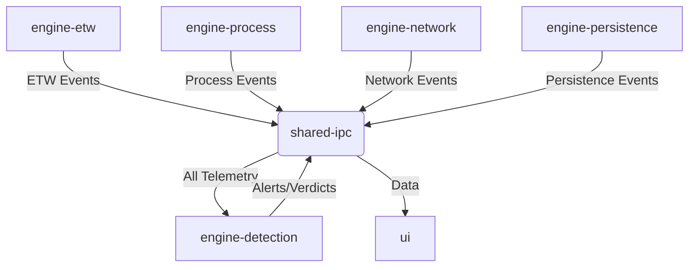

# SentraEDR Architecture

## Overview
SentraEDR is a modern, lightweight Anti-RAT / EDR platform designed for Windows. It emphasizes low memory consumption, behavioral analysis, and real-time threat detection.

## Architecture Philosophy
- **Event-Driven:** The engine relies exclusively on asynchronous event streaming, minimizing polling.
- **Modular Isolation:** Crates have single responsibilities and communicate only via the `shared-ipc` boundary using data definitions in `shared-models`.
- **Memory Efficiency:** Avoid excessive allocations, rely heavily on zero-copy serialization where possible, and enforce strict bounded queues.
- **Safe Remediation:** Never auto-delete. Follow a quarantine-first, dual-layered decision process.

## Workspace Structure
- `/engine`: Core analysis and telemetry crates.
  - `engine-etw`: Real-time ETW ingestion.
  - `engine-process`: Process hierarchy and token analysis.
  - `engine-network`: Network connection and beacon tracking.
  - `engine-persistence`: Registry, scheduled task, and service monitoring.
  - `engine-detection`: The central brain for threat correlation.
- `/shared`: Common logic.
  - `shared-models`: Schema definitions for events.
  - `shared-ipc`: Named pipe communication mechanisms.
- `/ui`: `dashboard-ui` built with Tauri and React.
- `/tools`, `/tests`, `/benchmarks`, `/docs`: Supporting infrastructure.

## Schema Versioning Policy
All normalized telemetry events (`NormalizedTelemetryEvent`) contain a `schema_version` field. 
- **Evolution:** The schema will evolve additively. New fields must be implemented as optional or have default values.
- **Backward Compatibility:** Engines must gracefully handle older versions without panicking. Version checks should route events to legacy normalization paths if structural changes occur.

## Tokio Runtime Design
We employ a multi-runtime separation to avoid cross-blocking. No runtime may block or starve another runtime:
1. **ETW Ingestion Runtime:** No blocking IO, dedicated to absorbing telemetry.
2. **Detection Engine Runtime:** Heuristic processing, scoring, and correlation logic.
3. **Network Analysis Runtime:** Packet parsing and connection tracking.
4. **IO/Persistence Runtime:** Disk and registry operations.

## Channel Architecture & Queue Tuning Strategy
- **Bounded Channels:** All inter-crate and intra-crate communication must use bounded `mpsc` channels. No unbounded channels are permitted in the production path.
- **Priority Routing:** Events are classified by priority (LOW, MEDIUM, HIGH, CRITICAL).
- **Queue Tuning & Drop Policy:** Queues define dynamic maximum capacities. During telemetry overload, `DROP_OLDEST` or `DROP_LOW_PRIORITY` policies are enforced to maintain backpressure.

## Cross-References
- [ENGINEERING_DISCIPLINE.md](ENGINEERING_DISCIPLINE.md) - For repository rules, failure modes (Telemetry Overload, Wrong Remediation, Crate Coupling Breakdown), and the human-in-the-loop workflow.
- [SECURITY_MODEL.md](../security/SECURITY_MODEL.md) - For EDR privilege and remediation confidence details.
- [THREAT_MODEL.md](../security/THREAT_MODEL.md) - For attack surfaces and mitigations.
- [TELEMETRY_MODEL.md](../telemetry/TELEMETRY_MODEL.md) - For ETW provider specifics.
- [MEMORY_MODEL.md](MEMORY_MODEL.md) - For memory allocation and zero-copy strategy.
- [IPC_DESIGN.md](IPC_DESIGN.md) - For named pipe design and `shared-models` schema validation.
- [DETECTION_ENGINE.md](DETECTION_ENGINE.md) - For behavioral scoring and analysis.

*(All crates independently rely on `shared-models` for schema definitions)*
